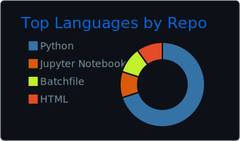

## GitHub Activity

## Skills & Tools

<table>
  <tr>
    <th>個人でもわりと使ってる</th>
    <th>学校の授業でやった</th>
    <th>興味あり</th>
  </tr>
  <td>
    
  </td>
  <td>
    
  </td>
  <td>
    
  </td>
</table>

## Works

現在行っている主な活動（の中で公開できるもの）は以下の通りです。

- OSS: [Gemini Discord BOT](https://github.com/konoka-iori/gemini-discord-bot)
- Webサイト: [全力開発ブログ](https://blog.zenryoku.dev)

## Blog Posts
<!-- BLOG-POST-LIST:START -->
- [WordPressからHugoに移行してみた](https://blog.zenryoku.dev/posts/wordpress-to-hugo/)
- [Discord Nitroを使ってみたのでレビュー！](https://blog.zenryoku.dev/posts/discord-nitro-review-2023/)
- [NVAPIを使ったVRAMの取得](https://blog.zenryoku.dev/posts/nvapi-vram-getting/)
- [iOS 14でDNS暗号化に対応　重要性と暗号化方式](https://blog.zenryoku.dev/posts/ios14-dns-encryption/)
- [今日が祝日かどうかjpholidayを使って判定する【Python】](https://blog.zenryoku.dev/posts/python-jpholiday/)
<!-- BLOG-POST-LIST:END -->
