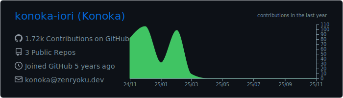

<h2 align="center" dir="auto">GitHub Activity</h2>

<h2 align="center" dir="auto">Skills & Tools</h2>
<table>
  <tr>
    <th>個人でもわりと使ってる</th>
    <th>学校の授業でやった</th>
    <th>興味あり</th>
  </tr>
  <td>
    
  </td>
  <td>
    
  </td>
  <td>
    
  </td>
</table>

## Works

## Blog Posts

<!-- BLOG-POST-LIST:START -->
- [WordPressからHugoに移行してみた](https://blog.zenryoku.dev/posts/wordpress-to-hugo/)
- [Discord Nitroを使ってみたのでレビュー！](https://blog.zenryoku.dev/posts/discord-nitro-review-2023/)
- [NVAPIを使ったVRAMの取得](https://blog.zenryoku.dev/posts/nvapi-vram-getting/)
- [iOS 14でDNS暗号化に対応　重要性と暗号化方式](https://blog.zenryoku.dev/posts/ios14-dns-encryption/)
- [今日が祝日かどうかjpholidayを使って判定する【Python】](https://blog.zenryoku.dev/posts/python-jpholiday/)
<!-- BLOG-POST-LIST:END -->
